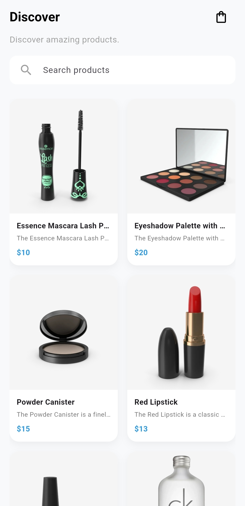
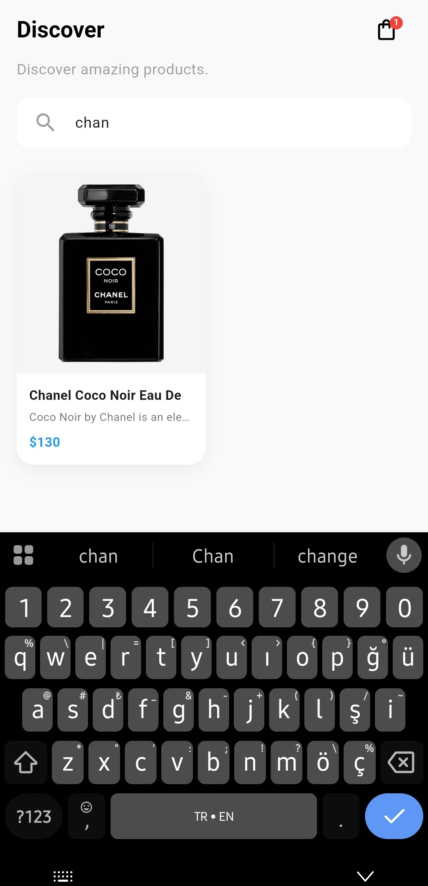
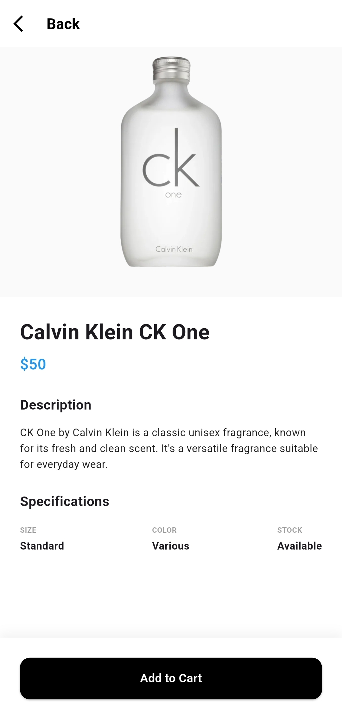
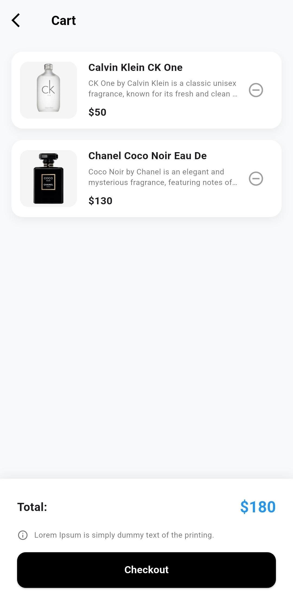
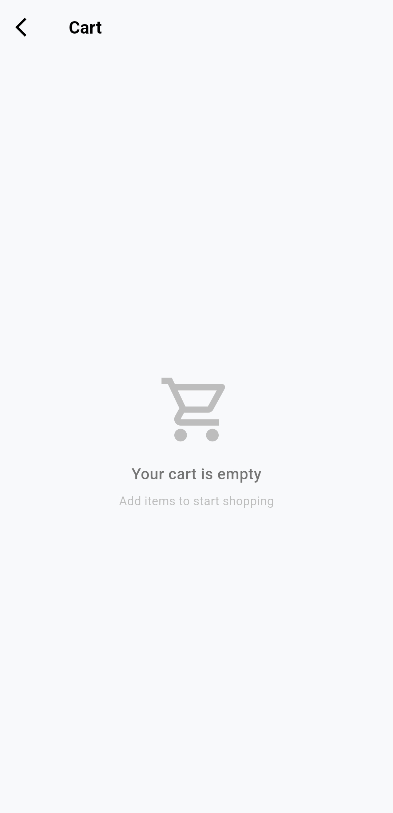
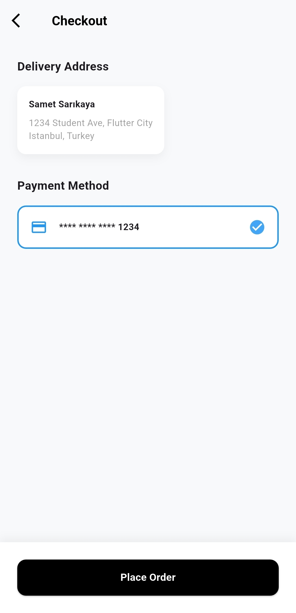

# Mini Catalog App

**Flutter Eğitimi Dönem Sonu Bitirme Projesi**

Merhaba, adım **Samet Sarıkaya**. Bu depo, Flutter eğitim dönemimiz sonunda bizden istenen "Mini Katalog Uygulaması" projesini içermektedir. Projeyi istenen tüm gereksinimlere ve UI tasarımlarına uygun olarak sıfırdan geliştirdim. 

## Proje Detayları

Bu uygulama, bir e-ticaret uygulamasının temel sayfalarını içerir. Projenin ana odağı widget ağacını kurmak, sayfalar arası geçişi sağlamak ve uzak bir sunucudan (internetten) verileri çekerek dinamik bir arayüz oluşturmaktı.

* **Durum Yönetimi (State):** Sadece `setState` kullanıldı, ek bir paket eklenmedi.
* **Ağ İstekleri:** `http` paketi kullanılarak internet üzerinden gerçek veriler çekildi.
* **Veri Kaynağı:** Ürün bilgileri için `https://dummyjson.com/products` API adresi kullanıldı.

## Uygulama Özellikleri

1. **Ana Sayfa (Discover):** 
   - Uygulama açıldığında API'den ürün listesi çekilir ve yükleme animasyonu gösterilir.
   - Veriler geldiğinde, grid yapısında (2 kolon) ürün kartları listelenir.
   - Üst kısımdaki arama barı sayesinde ürünler arasında isimle anlık arama yapılabilir, sağ üstteki sepet ikonunda sepete eklediğimiz ürün sayısı dinamik olarak artar.

2. **Ürün Detay Sayfası:** 
   - Ana sayfada bir karta tıklandığında `Navigator.push` ile bu sayfaya geçilir ve ürünün detayları (resim, açıklama, özellikler vb.) gösterilir.
   - Sayfanın altında yer alan "Add to Cart" butonuna tıklandığında ürün sepet listesine eklenir ve "Sepete Eklendi" şeklinde küçük bir bildirim (`SnackBar`) çıkartılır.

3. **Sepet Sayfası (Cart):** 
   - Eklenen ürünler bu sayfada yatay liste halinde alt alta gösterilir. 
   - Ürünlerin yanındaki (-) butonuna basarak sepetten ürün çıkartılabilir. Sepet boşsa özel bir uyarı ekranı beni karşılar.
   - Sepetin alt kısmında ürünlerin toplam fiyatı hesaplanır ve ekranda yazılır.

## Projeyi Çalıştırma

Projemi bilgisayarınızda derleyip incelemek isterseniz aşağıdaki adımları kullanabilirsiniz:

1. Terminalde projeyi indirin:
   ```bash
   git clone https://github.com/sametsarikaya/mini_catalog_app.git
   ```
2. Klasöre girin:
   ```bash
   cd mini_catalog_app
   ```
3. Paketleri yükleyin:
   ```bash
   flutter pub get
   ```
4. Uygulamayı başlatın:
   ```bash
   flutter run
   ```

## Ekran Görüntüleri

Uygulamamı geliştirirken emülatör üzerinden aldığım ekran görüntülerini aşağıda görebilirsiniz:

*(Not: Ekran görüntüleri **`screenshots`** klasörünün içine yerleştirildi.)*







